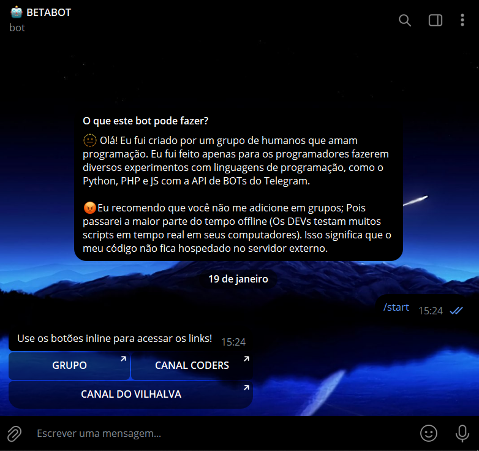

# BOTÕES DE URL
🌐BOT DO TELEGRAM QUE ENVIA BOTÕES INLINE CONTENDO LINKS.

 <br>

## DESCRIÇÃO:
O bot apresenta botões inline que, quando clicados, abrem URLs específicas.
Primeiramente ele enviará uma mensagem com os botões inline para acessar as URLs fornecidas. Ao clicar em um dos botões, o usuário será redirecionado para a URL correspondente.

## COMO USAR?
### BAIXANDO O PROJETO:
**Passo 1:** Clone o repositório para o seu sistema local.

```bash
git clone https://github.com/VILHALVA/BOTOES-DE-URL.git
```

**Passo 2:** Navegue até o diretório do projeto.

```bash
cd BOTOES-DE-URL
```

**Passo 3:** Descompacte o arquivo ZIP (se você baixou manualmente):

```bash
unzip BOTOES-DE-URL.zip
```

**Passo 4:** Execute o executável do projeto.

```bash
./BOTOES-DE-URL
```
### EXECUTANDO O PROJETO:
1. **Coloque o Token:**
   - Antes de executar o programa, é necessário substituir o token do seu bot, o qual pode ser obtido por meio do [@BotFather](https://t.me/BotFather). Certifique-se também de que todas as dependências estejam instaladas em sua máquina. Se você não estiver familiarizado com esses passos, confira nosso [curso completo sobre a criação de bots no Telegram](https://github.com/VILHALVA/CURSO-DE-TELEGRAM-BOT) para obter orientações detalhadas.

2. **Modifique o Código:**
    - Substitua `"GRUPO"`, `"CANAL CODERS"` e `"CANAL DO VILHALVA"` pelas URLs reais que você deseja usar para os botões.

3. **Inicie o Bot:**
    - Execute o bot do Telegram em Python iniciando-o com o seguinte comando:
```bash
   python CODIGO.py
```
   - Inicie o bot enviando o comando `/start`. Receba uma mensagem de boas-vindas e clique nos botões.

## CREDITOS:
- [PROJETO CRIADO PELO VILHALVA](https://github.com/VILHALVA)

